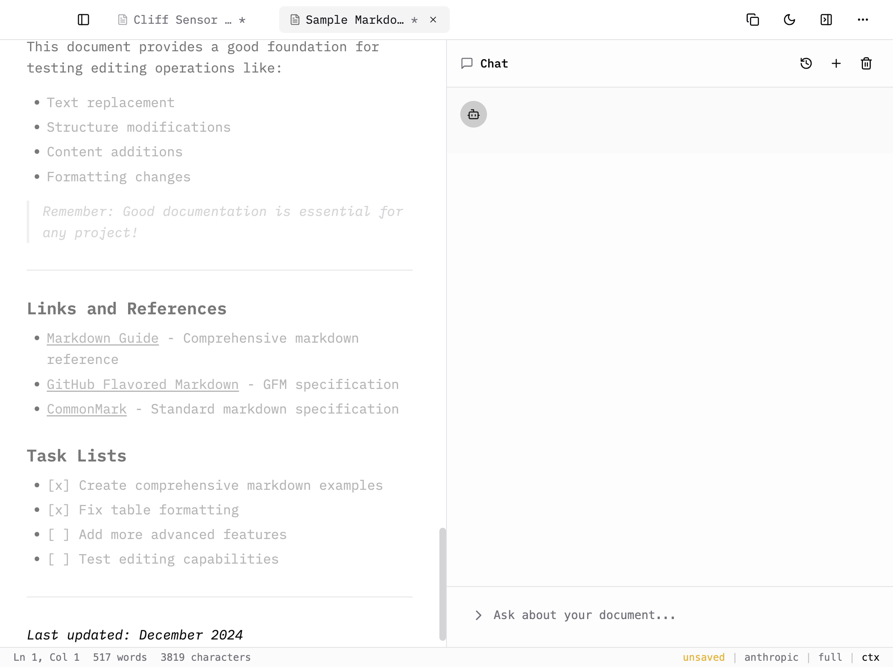

# Prose

> A minimal markdown editor with integrated AI chat. Think iA Writer meets Cursor.



Part of the [solo.ist](https://solo.ist) family.

## Features

- **Clean markdown editing** — Distraction-free writing with live preview
- **AI chat panel** — Claude-powered assistance with full document context
- **reMarkable sync** — Import handwritten notes from your tablet
- **Light/dark themes** — Easy on the eyes, day or night
- **Local files** — Plain .md files, your data stays yours

## Download

**Alpha Release** — Early preview, expect rough edges.

[Download for macOS (Apple Silicon)](https://github.com/solo-ist/prose/releases/latest)

*Intel Mac, Windows, and Linux coming soon.*

## Requirements

- macOS 11+ (Big Sur or later)
- [Anthropic API key](https://console.anthropic.com) for AI features
- Optional: reMarkable tablet for notebook sync

## Quick Start

1. Download and install Prose
2. Open Settings (⌘,) and add your Anthropic API key
3. Start writing!

### Unsigned App Warning

Prose isn't code-signed yet. macOS will show a misleading "damaged" error when you first open it. The app is not actually damaged. To fix this, open Terminal and run:

```bash
xattr -cr /Applications/Prose.app
```

Then open Prose normally. This is only required once after installation.

## Development

```bash
# Clone and install
git clone https://github.com/solo-ist/prose.git
cd prose
npm install

# Run in development
npm run dev

# Build for production
npm run build:mac
```

See [CLAUDE.md](CLAUDE.md) for architecture and development guidelines.

## Contributing

Contributions welcome! Please open an issue first to discuss what you'd like to change.

## License

MIT
