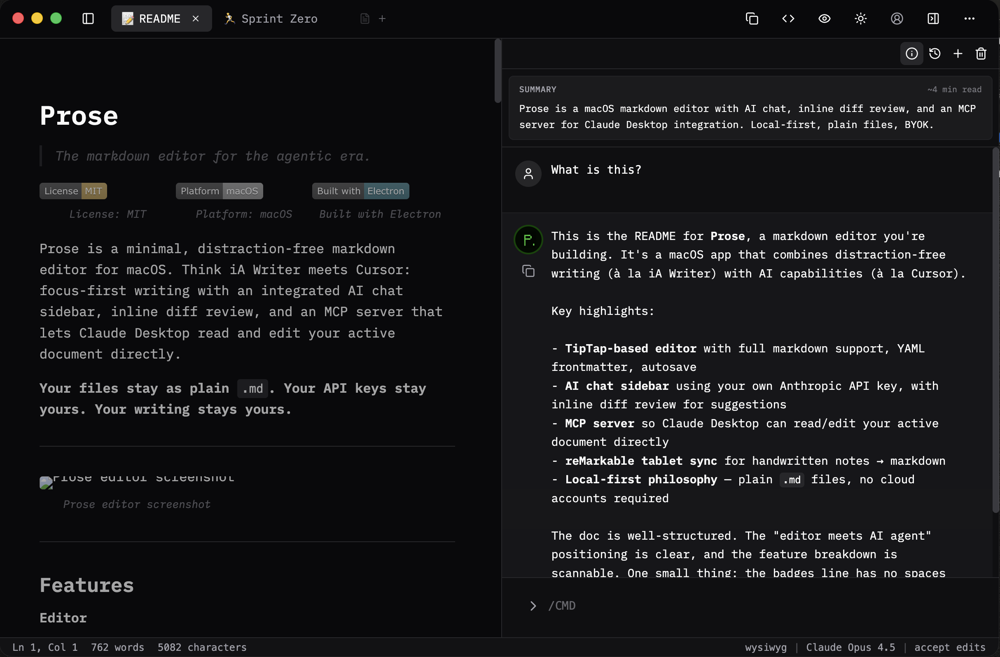

# Prose

> The markdown editor for the agentic era.

[](LICENSE) [](#) 

Prose is a minimal, distraction-free markdown editor for macOS. Think iA Writer meets Cursor: focus-first writing with an integrated AI chat sidebar, inline diff review, and an MCP server that lets Claude Desktop read and edit your active document directly.

**Your files stay as plain** `.md`**. Your API keys stay yours. Your writing stays yours.**

---



---

## Features

**Editor**

- Distraction-free TipTap editor with full markdown serialization
- YAML frontmatter support — parsed and preserved, never rendered
- Autosave with debounce
- Light and dark mode
- Standard markdown keyboard shortcuts

**AI**

- Integrated chat sidebar — bring your own Anthropic API key
- Add selected text or full document as chat context
- Inline diff review: AI suggestions shown as tracked changes, accept or reject individually
- API keys encrypted via Electron safeStorage (macOS Keychain, Windows DPAPI, or Linux libsecret)

**MCP Server**

- Prose ships an [MCP](https://modelcontextprotocol.io) server
- Connect Claude Desktop once; Claude can then open, read, and edit your active document without leaving your workflow
- Available tools: `read_document`, `suggest_edit`, `open_file`, `create_and_open_file`, `get_outline`

**Sync**

- reMarkable tablet sync via rmapi-js — handwritten notes → markdown via OCR
- Google Docs sync planned for v1.1

**Philosophy**

- **Local-first** — No required internet. Write on a plane, in a cabin, when the API is down. Your editor works when you do.
- **Plain files** — `.md` documents openable anywhere. They'll outlast this app.
- **Open source** — Read every line, fork it, build on it. MIT licensed. Prose exists to be useful — not to manufacture dependency.

---

## Getting Started

**Free to build on. Beautiful on Mac.**

### Download

[**Mac App Store →**](#) — sandboxed, auto-updates, Keychain credential storage

[**GitHub Releases →**](https://github.com/solo-ist/prose/releases) — direct download, free

### Build from source

Requires Node.js 20+.

```bash
git clone https://github.com/solo-ist/prose
cd prose
npm install
npm run dev
```

To build a distributable:

```bash
npm run build:mac
```

---

## Configuration

Prose stores settings at \~/.prose/settings.json (and uses macOS Keychain via Electron safeStorage for API credentials).

```json
{
  "theme": "dark",
  "llm": {
    "provider": "anthropic",
    "model": "claude-sonnet-4-20250514"
  },
  "editor": {
    "fontSize": 16,
    "lineHeight": 1.65,
    "fontFamily": "iA Writer Mono, monospace"
  }
}
```

---

## MCP Server

**Your editor has an API now.**

Point Claude Desktop at Prose and your editor becomes an agent-accessible workspace — Claude can read your document, suggest edits, and apply them without a single copy-paste. To connect:

```json
{
  "mcpServers": {
    "prose": {
      "command": "prose-mcp"
    }
  }
}
```

### Available tools

| Tool | Description |
| --- | --- |
| `read_document` | Returns the full markdown content of the active document |
| `get_outline` | Returns heading structure and node IDs |
| `suggest_edit` | Applies an edit to a specific node by ID |
| `open_file` | Opens a file by path |
| `create_and_open_file` | Creates a new `.md` file and opens it |

---

## Keyboard Shortcuts

| Action | Shortcut |
| --- | --- |
| Toggle AI chat | `⌘⇧L` |
| Add selection to chat | `⌘⇧K` |
| Send message | `⌘↵` |
| Toggle source view | `⌘⇧Y` |
| Toggle file list | `⌘⇧N` |
| Accept all diffs | `⌘⇧A` |
| Copy markdown | `⌘⇧T` |
| Open file | `⌘O` |
| Save | `⌘S` |
| Settings | `⌘,` |

---

## Stack

| Layer | Technology |
| --- | --- |
| Desktop shell | Electron |
| Renderer | React + TypeScript |
| Editor | TipTap + ProseMirror |
| UI | Tailwind CSS + ShadCN/ui |
| LLM abstraction | Vercel AI SDK |
| reMarkable sync | rmapi-js |
| Packaging | electron-builder |
| Build tool | electron-vite |

---

## Distribution

Prose ships two builds from one codebase:

**Mac App Store** — sandboxed, macOS Keychain for credentials, Apple's update mechanism, `IS_MAS_BUILD` flag excludes OSS-only features.

**OSS / Direct** — GitHub releases, `electron-updater` for auto-updates, full feature set including system audio capture (planned).

**App Store: $0.99 · GitHub Release: Free · Source: MIT**

---

## Contributing

Issues and PRs are welcome. For large changes, please open an issue first to discuss.

Commits generally follow Conventional Commits style.

---

## Roadmap

- \[x\] Core markdown editor
- \[x\] AI chat sidebar with BYOK
- \[x\] Inline diff review
- \[x\] MCP server
- \[x\] reMarkable sync
- \[ \] Google Docs sync (v1.1)
- \[ \] Audio transcription (Phase 1: cloud + mic)
- \[ \] Vector context for large documents
- \[ \] Authorship annotations (human vs AI)

See [open issues](https://github.com/solo-ist/prose/issues) and the [project board](https://github.com/orgs/solo-ist/projects) for current priorities.

---

## License

[MIT](LICENSE) — do whatever you want with it.

---

*Prose is part of [solo.ist](https://solo.ist) — tools for the personal software era.*
