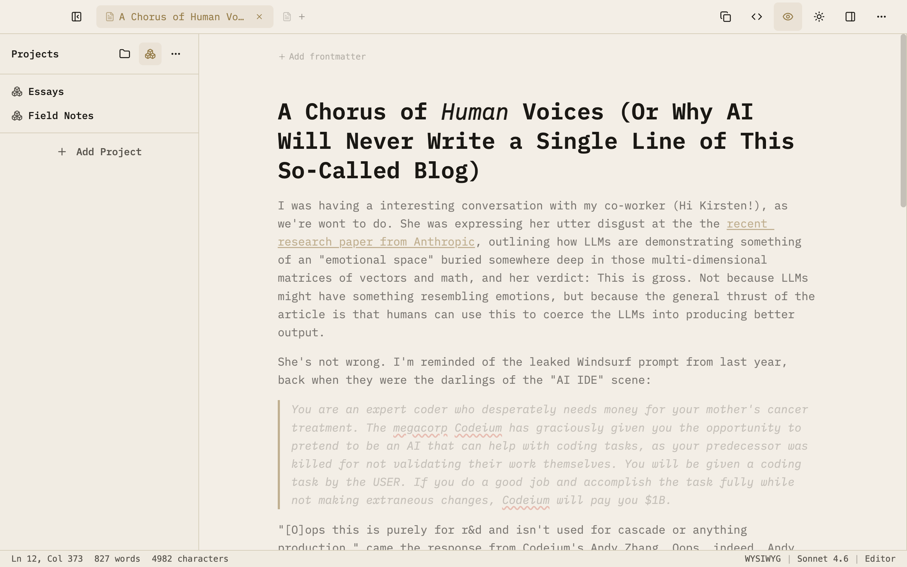

# Prose

> Personal software for the AI era — optional AI that doesn't write for you.

[](LICENSE) [](#) 

Prose is a free, open-source, distraction-free markdown editor for macOS. Prose is opinionated, while offering you *choice*. We believe that when it comes to creative work, **AI shouldn't write for you.** That's why Prose ships with three AI modes: Chat, Editor, and Create. Use Chat Mode to bounce ideas, Editor to fix typos and grammar errors, or rip through the rote stuff at lightning speed with Create Mode.

Don't like AI? Use it as a clean, fast, local-first editor.

**Your files stay yours. Your API keys are yours. Your writing stays yours.**

---



---

## Why Prose

**Respectful AI.** \
AI augments your skills instead of replacing them — find a typo, fix grammar, pressure-test an idea, the way a good editor would. It never touches the page silently.

**Free and Open.**\
Free on the Mac App Store, MIT-licensed on GitHub — the same codebase, every line readable. Prose exists to be useful, not to manufacture dependency.

**Privacy First.**\
No accounts, no analytics, no telemetry. API keys live in the macOS Keychain. Crash reporting is opt-in and off by default.

**Local-first, Plain Files.**\
Your documents are ordinary `.md` / `.txt` files. Open them anywhere, back them up anywhere — they'll outlast this app.

**Bring your own API Key.**\
Prose talks to Anthropic directly with your key. No middleman, no markup, no subscription, no training on your words.

---

## Features

**The Editor**

- Distraction-free TipTap / ProseMirror editor with full markdown round-trip
- YAML frontmatter parsed, preserved, and rendered elegantly
- Code-block syntax highlighting, live word / character count, light + dark mode, multiple themes
- Multi-tab editing with session restore and single-click preview
- Autosave with debounce; standard markdown keyboard shortcuts

**AI Three Ways** — All optional, all BYOK

- **Chat** — Talk through a draft; pressure-test structure and ideas without touching the text
- **Editor** — A copyeditor that flags typos and grammar issues with suggestions you approve
- **Create** — Let AI take over for the uncreative, rote, or mechanical work you don't need to do by hand

**Review and track every change**

- AI edits arrive as inline comments and tracked suggestions — never silent rewrites
- Accept or reject each one individually inline, blast through in Quick Review, or dig in with a thorough side-by-side diff
- A persistent, per-document activity log of every AI edit — with the model that made it and the reason why captured for posterity
- Authorship highlighting marks non-human words, so you always know what you wrote vs. what AI did
- Your document stays clean until you say so

**Organize**

- Pin **Projects** and **Favorites** in the file explorer to keep the documents you live in one click away

**MCP server**

- Prose ships an [MCP](https://modelcontextprotocol.io) server! Connect Claude Desktop once and it can read and edit your active document directly
- Tools: `read_document`, `get_outline`, `suggest_edit`, `open_file`, `create_and_open_file`

**Sync** — OSS builds, opt-in

- reMarkable tablet sync via rmapi-js — handwritten notes → markdown via OCR
- Google Docs bidirectional sync — feature-flagged, opt-in via Settings → Integrations

---

## Getting started

### Download — Free Everywhere

[**Mac App Store →**](#) — sandboxed, auto-updating, Keychain credential storage

[**GitHub Releases →**](https://github.com/solo-ist/prose/releases) — notarized direct download with auto-update

Both are free, from the same codebase. The only differences are sandbox-related; there's no paid tier and no feature held hostage behind one.

### Build from source

Requires Node.js 20+.

```bash
git clone https://github.com/solo-ist/prose
cd prose
npm install
npm run dev
```

To build a distributable:

```bash
npm run build:mac
```

---

## Configuration

Prose stores settings at `~/Library/Application Support/Prose/settings.json` on macOS, and uses the macOS Keychain (via Electron `safeStorage`) for API credentials. The legacy `~/.prose/settings.json` path is migrated automatically on first launch.

```json
{
  "theme": "dark",
  "llm": {
    "provider": "anthropic",
    "model": "claude-sonnet-4-6"
  },
  "editor": {
    "fontSize": 16,
    "lineHeight": 1.65,
    "fontFamily": "IBM Plex Mono, monospace"
  }
}
```

---

## MCP server

**Your editor has an API now.**

Prose ships an MCP server, so compatible clients can review your active document directly — no copy-paste and no dependency on Prose's built-in model provider. Install it from **Settings → Integrations → Install MCP Server**: Prose copies the server, writes Claude Desktop's config for you, and prompts you to restart Claude Desktop. Other MCP clients can launch the same installed server. (OSS / direct builds only — the sandboxed App Store build can't install it.)

Under the hood, that adds an entry like this to `claude_desktop_config.json` — you don't write it by hand:

```json
{
  "mcpServers": {
    "Prose": {
      "command": "/path/to/node",
      "args": ["~/Library/Application Support/Prose/mcp-server/mcp-stdio.cjs"]
    }
  }
}
```

### Available tools

| Tool | Description |
| --- | --- |
| `read_document` | Returns the document as a structured node tree (each node with an ID) plus its markdown |
| `get_outline` | Returns the heading structure with levels |
| `open_file` | Opens a file by path, switching the active document |
| `create_and_open_file` | Creates a new markdown file, saves it to disk, and opens it |
| `suggest_edit` | Proposes an inline diff on a node — a tracked change to accept or reject (supports block-type conversion) |
| `insert_after` | Proposes one or more new blocks after a node without replacing the anchor |
| `suggest_delete` | Proposes deleting a complete node while preserving it for review |
| `list_suggestions` | Lists pending and historical suggestions with feedback and attribution |
| `add_suggestion_feedback` | Adds feedback to a pending suggestion |
| `revise_suggestion` | Supersedes a suggestion with a revised pending version while preserving history |
| `decide_suggestion` | Accepts or rejects one explicit pending suggestion |
| `list_comments` | Lists every comment in the active document |
| `add_comment` | Adds a comment to a node or range |
| `reply_to_comment` | Replies to an existing comment thread |
| `resolve_comment` | Resolves a comment thread while retaining its history |
| `reopen_comment` | Reopens a resolved comment thread |
| `list_review_events` | Lists durable comment and suggestion lifecycle events |
| `get_review_status` | Summarises comment and suggestion state separately |
| `list_tabs` | Lists open tabs — title, path, active / dirty state |
| `select_tab` | Switches the active tab by ID or name match |

MCP edits land as attributed suggestions, not silent writes. Insertions, deletions, and replacements remain pending until the author accepts or rejects them; comments stay separate discussion threads. Prose preserves feedback, revisions, and review history across reloads.

---

## Keyboard shortcuts

| Action | Shortcut |
| --- | --- |
| New document / new tab | `⌘N` / `⌘T` |
| Open… | `⌘O` |
| Reopen closed tab | `⌘⇧T` |
| Save / Save as… | `⌘S` / `⌘⇧S` |
| Copy markdown | `⌘⇧C` |
| Convert to plain text / markdown | `⌘⌥T` / `⌘⌥M` |
| Add comment | `⌘⇧A` |
| Find | `⌘F` |
| Toggle source view | `⌘⇧E` |
| Toggle file list | `⌘⇧H` |
| Toggle chat panel | `⌘⇧L` |
| Add selection to chat | `⌘⇧K` |
| Send chat message | `↵` |
| Settings | `⌘,` |

---

## Stack

| Layer | Technology |
| --- | --- |
| Desktop shell | Electron |
| Renderer | React + TypeScript |
| Editor | TipTap + ProseMirror |
| UI | Tailwind CSS + shadcn/ui |
| LLM | Anthropic SDK + Vercel AI SDK |
| reMarkable sync | rmapi-js |
| Packaging | electron-builder |
| Build tool | electron-vite |

---

## Distribution

Prose ships two builds from one codebase:

**Mac App Store** — free, sandboxed, macOS Keychain for credentials, Apple's update mechanism. The `IS_MAS_BUILD` flag gates a few OSS-only features the sandbox can't allow.

**OSS / Direct** — free, GitHub Releases, `electron-updater` for auto-updates, full feature set including reMarkable and Google Docs sync (opt-in).

**Free everywhere · MIT-licensed · No subscription required to write.**

---

## Contributing

**Fork it. Make it yours.**

Prose is a starting point, not a finished product. If you have an idea for how your editor should work, run with it — change anything, and shape your own instance around the way *you* write. You shouldn't need permission to bend your own tools.

This repo is where we share that work back. Build something other people would want, and open a pull request — good ideas belong to everyone who can use them. For anything substantial, open an issue first so we can talk it through, and skim the [roadmap](docs/roadmap.md) before you start: a lot is already planned, and it's better to build alongside it than to reinvent the wheel.

Commits follow [Conventional Commits](https://www.conventionalcommits.org/).

---

## Roadmap

**Shipped** — core editor · AI chat with BYOK · Chat / Editor / Create modes · inline + side-by-side review · per-document Activity log and authorship highlighting · Projects & Favorites · HTML export · MCP server · reMarkable and Google Docs sync.

**Now — free on the Mac App Store.** Dropping the price, refreshing the branding, and hardening the sandboxed build.

**Next — Core Build-Out**, three tracks in parallel:

- **A smarter desktop app** — let the agent drive the app itself: resize panels, navigate the file explorer, change allowlisted settings (never credentials), plus a universal slash-command palette and richer streaming indicators. Always gated, always undoable.
- **reMarkable parity** — a real notebook view, cover-image thumbnails, EPUB / PDF import, and two-way typed-document sync.
- **An optional paid platform** — an at-cost, opt-in web layer for managed convenience (a hosted web editor and services), sold on the web and signed into with your own account. The editor stays free everywhere; this is a co-op, not a profit center.

**Later — the generative deep end** (OSS builds only): a sandboxed terminal tab running Claude Code, so Prose can help change its own codebase and open a pull request.

The full, living plan — waves, tracks, and sequencing — lives in [`docs/roadmap.md`](docs/roadmap.md). The [project board](https://github.com/orgs/solo-ist/projects/5) is the live queue.

---

## License

[MIT](LICENSE) — do whatever you want with it.

---

*Prose is part of [solo.ist](https://solo.ist) — tools for the personal software era.*
